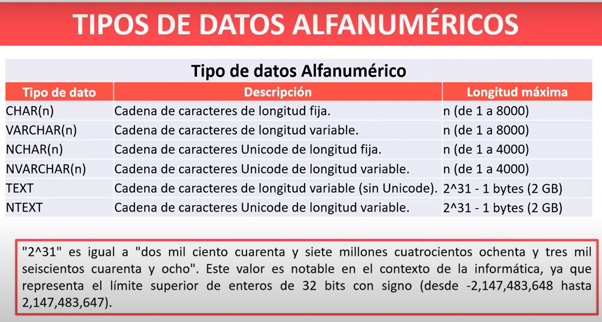
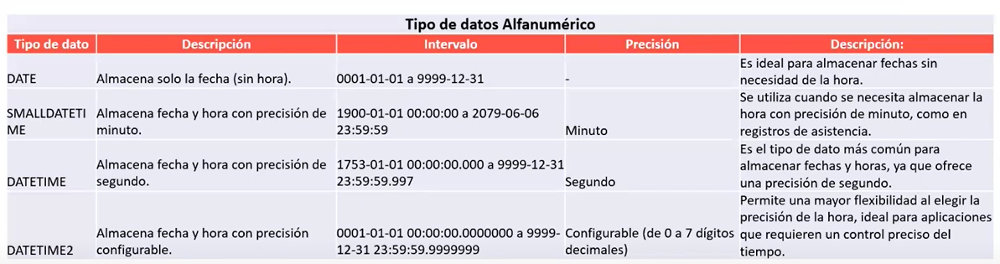
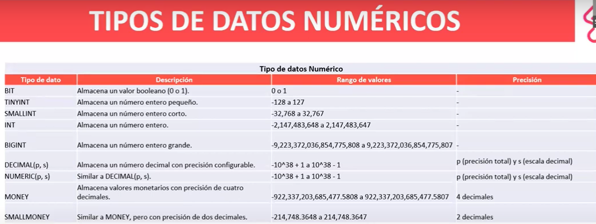

## Realizar consultas de AdventureWorks

https://learn.microsoft.com/es-es/sql/samples/adventureworks-install-configure?view=sql-server-ver16&tabs=ssms

Descargar el primer link de OLTP

```
-- Selecionar la versión
SELECT  @@VERSION
-- Usar bd
USE AdventureWorks2022
-- Salto de línea
GO
```

Un backup se guarda como tipo de archivo de `bak`

## Base de datos:
- Es un contenedor que almacena y gestiona datos de manera estructurada.

PK: Identificadir de manera única.
FK: Relación con otra tabla.

## Tipos de datos




 - Se utiliza más DATETIME


- Se utiliza int
- El más preciso es el decimal para entidades bancarias

## ¿Qué es transact SQL?

- Interactua con la base de datos para realizar tareas comunes como insertar nuevos registros, entre otros. Tambien incluye elementos de programación para automatizar tareas.


